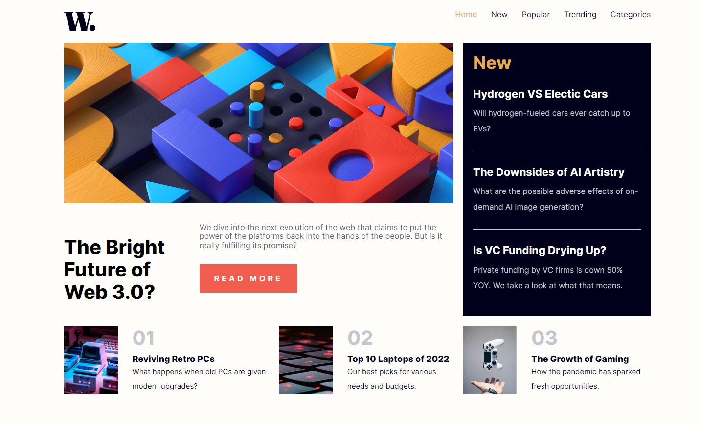

# Frontend Mentor - Solución de página de inicio de noticias

Esta es una solución al [Desafío de la página de inicio de noticias en Frontend Mentor](https://www.frontendmentor.io/challenges/news-homepage-H6SWTa1MFl). Los desafíos de Frontend Mentor lo ayudan a mejorar sus habilidades de codificación mediante la creación de proyectos realistas.

## Tabla de contenidos

- [Resumen](#resumen)
  - [El reto](#el-reto)
  - [Captura de pantalla](#captura-de-pantalla)
  - [Enlaces](#enlaces)
- [Mi proceso](#mi-proceso)
  - [Construido con](#construido-con)
  - [Lo que aprendí](#lo-que-aprendí)
  - [Desarrollo continuo](#desarrollo-continuo)
  - [Recursos útiles](#recursos-útiles)
- [Autor](#autor)

## Visión general

### El reto

Los usuarios deben ser capaces de:

- Ver el diseño óptimo para la interfaz según el tamaño de pantalla de su dispositivo
- Vea los estados de desplazamiento y enfoque para todos los elementos interactivos en la página
- **Bonificación**: Cambia el menú móvil (requiere algo de JavaScript)

### Captura de pantalla



### Enlaces

- URL de la solución: [news homepage](https://news-homepage-jjmm.netlify.app/)

## My process

## Mi proceso

### Construido con

- Marcado HTML5 semántico
- Propiedades personalizadas de CSS
- Flexbox
- Grid layout
- Flujo de trabajo móvil primero
- [React](https://reactjs.org/) - Libreria de javascript
- [Sass](https://sass-lang.com/) - Para los estilos
- [Gulp](https://gulpjs.com/) - Para el compilado de Sass a css

### Lo que aprendí

Este proyecto tuve oportunidad de seguir aprendiendo sobre react-router-dom para guiar a los usuarios por una navegacion mas rapida y efectiva.

```javascript
<Routes>
	<Route path="/" element={<HomePage />} />
	<Route path="/new" element={<NewPage />} />
	<Route path="/popular" element={<PopularPage />} />
	<Route path="/trending" element={<TrendigPage />} />
	<Route path="/categories" element={<CategoriesPage />} />
	<Route path="*" element={<NoFundPage />} />
</Routes>
```

### Nunca Parar de Aprender

Para mis siguientes proyectos, voy empezar a utilizar el hook useReducer para un mejor escalado de mis aplicaciones.

### Recursos útiles

- [Función onChange y onBlur](https://bluuweb.github.io/react/formularios/) - Este es un artículo increíble que me permitió reducir el código. Esta función me ayudó a escuchar los cambios en todas las entradas en lugar de hacer una función para cada una de ellas.

## Author

- Frontend Mentor - [@jhonnymosquera](https://www.frontendmentor.io/profile/jhonnymosquera)
- Gmail - [jhonnymosquera16@gmail.com](https://www.gmail.com)
